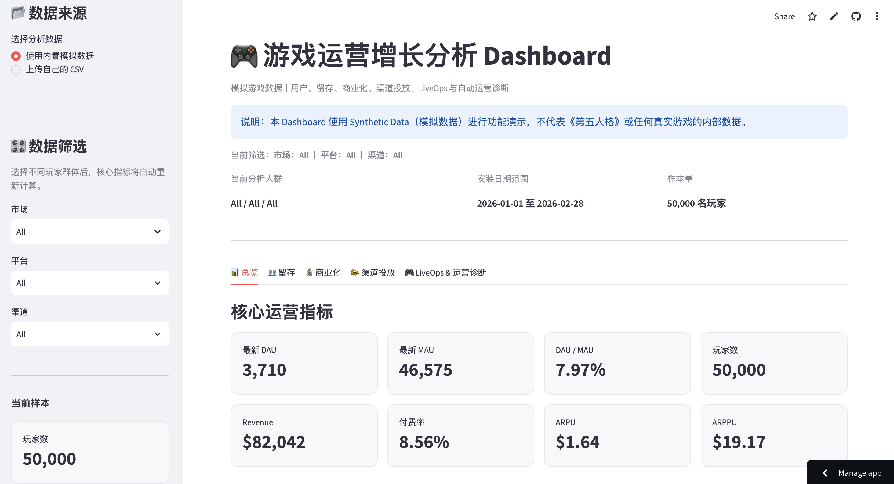
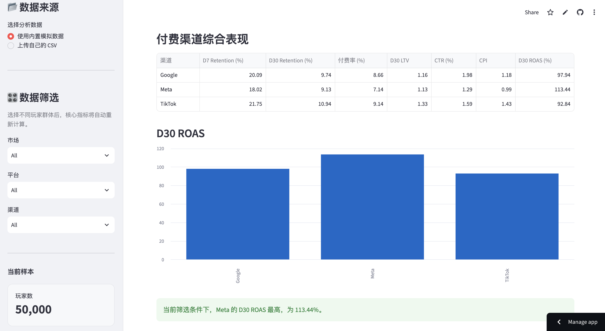
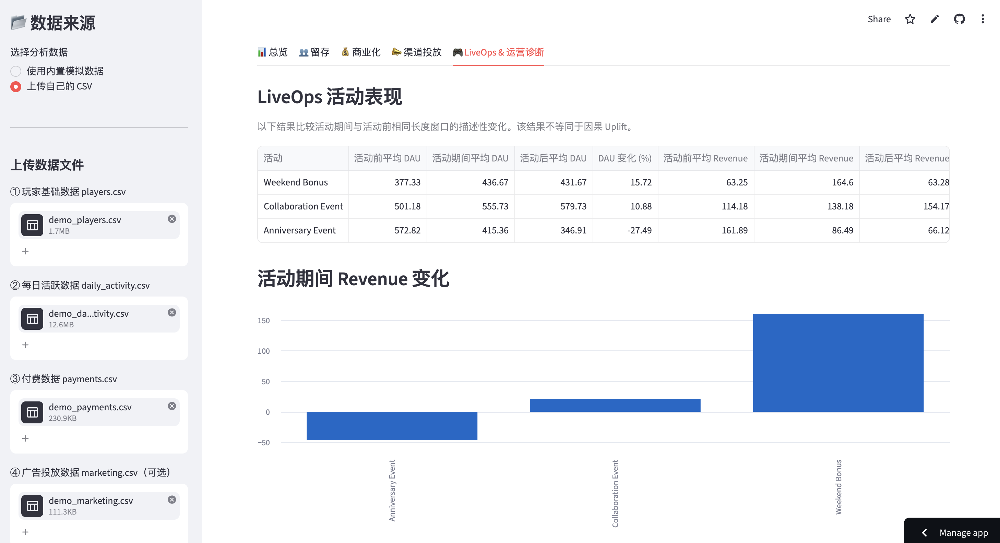

# 🎮 Game LiveOps Analytics Dashboard

## 游戏运营增长分析工具

面向游戏运营、商业化、游戏营销及渠道分析场景构建的交互式数据分析 Dashboard。

项目使用 Python、pandas 与 Streamlit，将玩家行为、留存、付费、广告投放及 LiveOps 活动数据整合到同一分析工具中，并支持用户上传 CSV 后自动重新计算核心指标、切换分析人群，并生成动态运营诊断。

> 📌 本项目使用 Synthetic Data（模拟数据）进行功能演示，不代表《第五人格》或任何真实游戏的内部数据。

---

## 🌐 Online Demo

在线体验：

**Streamlit Dashboard**

https://game-liveops-analytics-knwcg89t6yxtbfstskwm2u.streamlit.app/

推荐进入 Dashboard 后尝试不同筛选条件：

- 市场：JP / US
- 平台：iOS / Android
- 渠道：TikTok / Meta / Google / Organic

并观察 DAU、Retention、ARPU、ROAS、LiveOps 及运营诊断如何随筛选条件动态变化。

---

## 📊 Dashboard Preview

### 总览与核心 KPI



### 渠道投放与 ROAS 分析



### LiveOps 活动分析



---

## 🎯 项目背景

游戏运营和营销决策通常需要同时观察用户规模、留存、商业化、买量效率和活动效果。

单独查看某一个指标，往往无法回答真正的业务问题。

例如：

- 一个渠道带来的玩家留存更高，是否意味着应该增加预算？
- 高 ARPU 是否一定意味着渠道投放效率更高？
- 活动期间 Revenue 上升，是更多玩家付费，还是付费深度提升？
- D30 ROAS 未达到 100% 时，问题来自用户质量还是获客成本？
- 一个 LiveOps 活动带来短期活跃增长后，是否还能形成长期用户价值？

因此，本项目尝试建立一套从：

**User Acquisition → Retention → Monetization → LiveOps → Business Insight**

的游戏运营分析流程。

---

## ✨ 核心功能

### 1. 用户与活跃分析

支持计算和展示：

- DAU
- MAU
- DAU / MAU Stickiness
- DAU 趋势
- 玩家规模

用户可以按照市场、平台和渠道筛选不同玩家群体，并动态重新计算相关指标。

---

### 2. Retention 留存分析

自动计算：

- D1 Retention
- D7 Retention
- D30 Retention

支持按照以下维度比较不同玩家群体：

- 市场
- 平台
- 渠道

用于识别不同来源玩家在短期和中长期留存上的差异。

---

### 3. 商业化分析

支持计算：

- Revenue
- 付费率
- ARPU
- ARPPU
- D30 LTV

通过同时观察付费率与 ARPPU，可以进一步区分：

**付费转化问题** 与 **付费深度问题**。

---

### 4. 渠道投放分析

将广告投放成本与玩家后续价值结合，计算：

- Spend
- Impressions
- Clicks
- Installs
- CTR
- CPI
- D30 LTV
- D30 ROAS

用于分析：

**用户质量并不等于渠道投放效率。**

例如，一个渠道可能带来高留存、高 LTV 玩家，但如果 CPI 过高，最终 ROAS 仍可能低于其他渠道。

---

### 5. LiveOps 活动分析

支持上传活动日历后自动计算：

- 活动前平均 DAU
- 活动期间平均 DAU
- 活动后平均 DAU
- DAU 变化
- 活动前平均 Revenue
- 活动期间平均 Revenue
- 活动后平均 Revenue
- Revenue 变化

LiveOps 结果还会随市场、平台和渠道筛选条件动态变化。

对于用户上传的数据，系统将结果解释为：

**活动期间相对于活动前的描述性变化，而非严格的因果 Uplift。**

---

### 6. 自动运营诊断

Dashboard 会根据当前上传数据及筛选条件动态生成基础运营诊断。

诊断内容包括：

- 用户留存表现
- 付费转化情况
- ARPU / ARPPU
- 渠道获客成本
- D30 ROAS
- LiveOps 活动表现

例如：

> TikTok 玩家价值较高，但 CPI 较高，导致 D30 ROAS 偏低。问题更可能来自获客成本，而不是用户质量，因此应优先优化素材、受众、版位和出价，而不是直接停止投放。

当前版本使用：

**Rule-based Insight Engine（规则型运营诊断引擎）**

诊断逻辑会随当前数据动态变化，而不是固定写入预设结论。

---

## 💡 模拟数据中的示例业务洞察

以下结论仅用于展示分析逻辑，不代表真实市场情况。

### Meta：投放效率较高

模拟数据中，Meta 玩家在留存和 ARPU 上并非最高，但 CPI 较低，使其 D30 ROAS 达到较高水平。

这说明：

> 用户质量相对较弱，不一定意味着渠道投放效率较差。

---

### TikTok：用户价值高，但获客成本偏高

TikTok 在模拟数据中拥有较高的：

- Retention
- 付费率
- ARPU
- D30 LTV

但同时 CPI 最高，因此 D30 ROAS 并未达到最佳水平。

这说明：

> 高质量用户如果获取成本过高，最终投放回报仍可能受到影响。

---

### JP vs US

模拟数据中，JP 玩家在 Retention 和 D30 LTV 上表现更高。

但 Dashboard 不直接将其解释为：

> “日本玩家价值一定更高。”

而是建议进一步拆分：

- 渠道
- 平台
- 活动参与
- 用户结构

以判断差异真正来自哪里。

---

## 🧠 分析思路

本项目遵循：

**Data → Metric → Insight → Action**

而不是只展示图表。

例如在渠道分析中，不会只根据 ROAS 单独做判断，而是同时观察：

**Retention + LTV + CPI + ROAS**

进一步判断问题可能来自：

- 用户质量
- 获客成本
- 商业化效率
- 渠道结构
- 是否适合扩量
- 是否需要进一步测试

---

## 🎛️ 交互筛选

Dashboard 当前支持三类筛选条件。

### 市场

- All
- JP
- US

### 平台

- All
- iOS
- Android

### 渠道

- All
- TikTok
- Meta
- Google
- Organic

筛选后，以下内容会根据当前玩家群体重新计算：

- DAU
- MAU
- DAU / MAU
- D1 / D7 / D30 Retention
- Revenue
- 付费率
- ARPU
- ARPPU
- D30 LTV
- 渠道表现
- LiveOps 活动表现
- 自动运营诊断

---

## 📂 CSV 上传分析

除了使用内置模拟数据，用户还可以上传自己的 CSV 数据进行分析。

---

### players.csv

必需字段：

| 字段 | 含义 |
|---|---|
| user_id | 玩家 ID |
| install_date | 安装日期 |
| country | 市场 / 国家 |
| platform | iOS / Android |
| channel | 获客渠道 |

---

### daily_activity.csv

必需字段：

| 字段 | 含义 |
|---|---|
| user_id | 玩家 ID |
| date | 活跃日期 |
| day_since_install | 安装后的第几天 |

---

### payments.csv

必需字段：

| 字段 | 含义 |
|---|---|
| user_id | 玩家 ID |
| payment_date | 付费日期 |
| day_since_install | 安装后的第几天 |
| amount_usd | 付费金额 |

---

### marketing.csv（可选）

主要字段：

| 字段 | 含义 |
|---|---|
| date | 投放日期 / Cohort 日期 |
| country | 市场 |
| platform | 平台 |
| channel | 渠道 |
| spend | 广告费用 |
| impressions | 展示量 |
| clicks | 点击量 |
| installs | 安装量 |

系统可以进一步计算：

- CTR
- CPI
- D30 ROAS

---

### liveops_events.csv（可选）

必需字段：

| 字段 | 含义 |
|---|---|
| event_name | 活动名称 |
| start_date | 活动开始日期 |
| end_date | 活动结束日期 |

系统将自动比较活动前、活动期间和活动后的 DAU 与 Revenue 表现。

---

## 🛠️ 技术栈

### Python

用于数据处理、指标计算和运营分析逻辑。

### pandas

用于玩家、活跃、付费、投放和活动数据的清洗、合并、聚合与计算。

### Streamlit

用于构建可交互的 Web Dashboard。

### GitHub

用于代码管理、版本控制和作品集展示。

### Google Colab

用于模拟数据生成、指标验证及早期分析开发。

---

## 📁 项目结构

```text
game-liveops-analytics/
├── app.py
├── README.md
├── requirements.txt
│
├── assets/
│   ├── dashboard_overview.png
│   ├── channel_analysis.png
│   └── liveops_analysis.png
│
├── data/
│   ├── demo_players.csv
│   ├── demo_daily_activity.csv
│   ├── demo_payments.csv
│   ├── demo_marketing.csv
│   └── demo_liveops_events.csv
│
├── notebooks/
│   └── 01_generate_demo_data.ipynb
│
└── outputs/
    ├── daily_kpis.csv
    ├── retention_summary.csv
    ├── country_monetization.csv
    ├── channel_monetization.csv
    ├── channel_ua_summary.csv
    ├── channel_performance_summary.csv
    ├── liveops_event_uplift.csv
    └── auto_insights.csv
```

---

## ⚠️ 数据说明与分析边界

本项目的内置数据为人为构建的模拟游戏数据，主要用于展示分析方法和 Dashboard 功能。

因此需要注意：

1. 示例中的国家、平台和渠道差异不代表真实游戏市场规律。

2. ROAS 衡量的是归因收入与媒体投放成本之间的关系，不等同于公司最终利润。

3. 用户上传 LiveOps 数据时，活动前后比较只能描述指标变化，不能单独证明活动造成了这些变化。

4. 自动运营诊断目前采用规则型逻辑，属于辅助分析，不应替代真实业务环境中的完整判断。

5. 实际业务中还应进一步结合用户画像、素材表现、服务器环境、活动参与率及其他运营信息。

---

## 🚀 Future Improvements

后续可进一步扩展：

- Cohort Retention 热力图
- 玩家生命周期分群
- Whale / Dolphin / Minnow 付费玩家分析
- Creative 素材表现分析
- D60 / D90 LTV 与 ROAS
- 更完整的 LiveOps 活动归因
- A/B Test 分析
- LLM-based AI Insight
- 自动生成运营分析报告

---

## 👤 项目定位

本项目主要用于展示以下能力：

**游戏运营分析｜商业化分析｜游戏营销｜渠道投放｜用户增长｜数据分析｜自动化运营诊断**

重点并不是展示复杂算法，而是展示：

> 如何将数据指标转化为游戏运营和营销中的业务判断。
